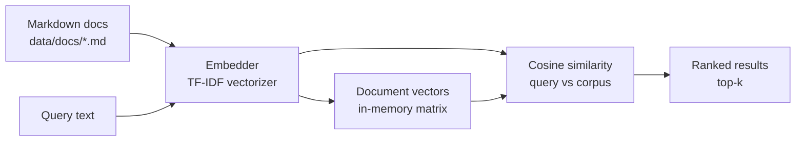

# semantic-doc-search

> Embeddings-based semantic search over a documentation corpus, served as a FastAPI app with a tiny browser search page.


## Overview

`semantic-doc-search` indexes a small corpus of Markdown documentation and lets
you search it by meaning rather than exact keywords. Each document is turned
into a vector by a pluggable **embedding backend**; a query is embedded the same
way and ranked against the corpus by cosine similarity.

The shipped default backend is a scikit-learn **TF-IDF** vectorizer, chosen so
the whole demo runs **fully offline** with no model downloads or external
services. The `Embedder` interface is deliberately small so a real transformer
model (for example, `sentence-transformers`) can be dropped in later without
touching the index or API code.

This is a portfolio / demo project — no production claims, no benchmarks.

## Architecture



The `Embedder` protocol is the seam: swap the backend and everything downstream
(indexing, ranking, API) stays the same.

## Swapping in a real embedding model

The default `TfidfEmbedder` captures *lexical* similarity and runs offline. To
capture *semantic* similarity, implement the same two-method `Embedder`
protocol (`app/embedder.py`) with a transformer model — nothing else changes:

```python
# app/embedder.py (or a new module)
from __future__ import annotations

import numpy as np
from sentence_transformers import SentenceTransformer


class SentenceTransformerEmbedder:
    """Dense semantic embeddings via sentence-transformers."""

    def __init__(self, model_name: str = "all-MiniLM-L6-v2") -> None:
        self._model = SentenceTransformer(model_name)

    def fit(self, documents: list[str]) -> "SentenceTransformerEmbedder":
        # Pretrained models learn no per-corpus state, so fit is a no-op.
        return self

    def encode(self, texts: list[str]) -> np.ndarray:
        # normalize_embeddings=True keeps cosine similarity meaningful.
        return self._model.encode(
            texts, normalize_embeddings=True
        ).astype(np.float32)
```

Then inject it where the index is built — the `SearchIndex` and `from_dir`
constructors already accept an `embedder`:

```python
# app/main.py, inside get_index()
from app.embedder import SentenceTransformerEmbedder

return SearchIndex.from_dir(DOCS_DIR, embedder=SentenceTransformerEmbedder())
```

Add `sentence-transformers` to `requirements.txt`. Because it downloads model
weights on first use, it is intentionally *not* a default dependency — the demo
stays network-free out of the box.

## Features

- Semantic ranking of documents by cosine similarity over embedding vectors.
- Match-aware result snippets: the preview centres on the matching passage and
  the UI highlights query terms.
- Pluggable `Embedder` protocol with an offline TF-IDF default.
- FastAPI service: `GET /`, `GET /health`, `GET /search?q=&k=`.
- Minimal vanilla-JS search page — no external CDNs, no build step.
- Ships with 8 realistic cloud / devops / AI sample docs.
- Tests, ruff linting, a Dockerfile, and GitHub Actions CI.

## Tech stack

- **Python 3.11**
- **FastAPI** + **Uvicorn** for the web service
- **scikit-learn** (TF-IDF + cosine similarity) as the default embedding backend
- **numpy** for vector math
- **pytest** for tests, **ruff** for linting

## Getting started

```bash
# 1. Clone and enter the project
git clone https://github.com/matthews-wong/semantic-doc-search.git
cd semantic-doc-search

# 2. Create a virtual environment and install dependencies
python -m venv .venv
source .venv/bin/activate      # Windows: .venv\Scripts\activate
pip install -r requirements.txt

# 3. Run the service
uvicorn app.main:app --reload
```

Then open <http://localhost:8000> for the search UI.

### With Docker

```bash
docker build -t semantic-doc-search .
docker run --rm -p 8000:8000 semantic-doc-search
```

Or, for a one-command run with a built-in health check:

```bash
docker compose up --build
```

Then open <http://localhost:8000>.

## Usage

Open the web UI at <http://localhost:8000> and type a natural-language query,
or call the API directly:

```bash
# Health check
curl "http://localhost:8000/health"

# Search (URL-encode the query)
curl "http://localhost:8000/search?q=how%20do%20I%20keep%20a%20pod%20healthy&k=3"
```

Example response:

```json
{
  "query": "how do I keep a pod healthy",
  "terms": ["pod", "healthy"],
  "count": 3,
  "results": [
    {
      "doc_id": "kubernetes-probes",
      "title": "Kubernetes Health Probes",
      "score": 0.1201,
      "snippet": "# Kubernetes Health Probes Kubernetes uses probes to decide whether a container is healthy and ready to serve traffic..."
    }
  ]
}
```

The `snippet` is centred on the matching passage and `terms` lists the query
words worth highlighting; the web UI wraps them in `<mark>`.

```
```

Interactive API docs are available at <http://localhost:8000/docs>.

## Project structure

```
semantic-doc-search/
├── app/
│   ├── __init__.py
│   ├── embedder.py      # Embedder protocol + TfidfEmbedder
│   ├── index.py         # corpus loading, index build, query/rank
│   └── main.py          # FastAPI app: /, /health, /search
├── static/
│   └── index.html       # minimal search UI (vanilla JS fetch)
├── data/docs/           # sample Markdown corpus
├── tests/
│   ├── test_index.py    # indexing + semantic-match + snippet tests
│   └── test_api.py      # /health + /search HTTP contract tests
├── .github/workflows/ci.yml
├── Dockerfile
├── docker-compose.yml
├── .dockerignore
├── pyproject.toml
├── requirements.txt
├── LICENSE
└── README.md
```

## Testing

```bash
pytest            # run the test suite
ruff check .      # lint
```

The tests build the index over the shipped corpus and assert that topical
queries return the semantically closest document.

## Roadmap

Honest next steps for turning this demo into something sturdier:

- Swap the TF-IDF backend for a real embedding model (e.g.
  `sentence-transformers`) behind the existing `Embedder` interface.
- Add a real vector database (e.g. Qdrant, pgvector, or FAISS) for approximate
  nearest-neighbor search once the corpus outgrows an in-memory matrix.
- Persist and cache embeddings instead of rebuilding the index on startup.
- Add chunking for long documents and return matching passages, not whole docs.
- Highlight matched terms and add filtering/pagination in the UI.

## License

MIT — see [LICENSE](LICENSE). Copyright (c) 2026 Matthews Wong.

---

Part of my cloud & AI portfolio — see [github.com/matthews-wong](https://github.com/matthews-wong).
